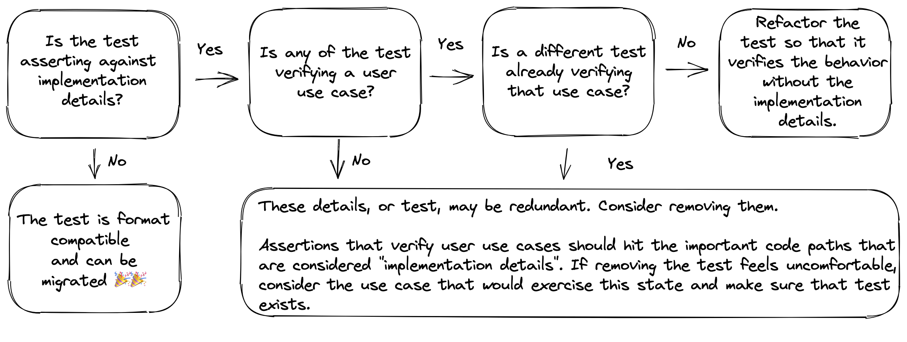

# Migrating Test Expectations

## Philosophy

### Best Practice

When it comes to the expectation statements in a migration, React Testing Library's (RTL) philosophy becomes even more important.

> [The more your tests resemble the way your software is used, the more confidence they can give you.](https://testing-library.com/docs/guiding-principles)
>
> \- Kent C. Dodds

A key take away from that quote is [not to test implementation details][implementation-details-blog]. This is important here because RTL is opinionated towards avoiding the implementation details, making the right thing the easy thing. On the flip side, if we need to refactor tests that historically deviated from this path, writing those tests become a lot more challenging.

### Don't Test Implementation Details

When it's said not to test implementation details, what does that mean? Dodds [addresses][implementation-details-blog-implementation-explanation] that question. His short answer is:

> Implementation details are things which users of your code will not typically use, see, or even know about.

That means implementation details can be somewhat insidious. It's not just about avoiding using certain getters or patterns, but also about understanding what an API can give to a user and only testing those possibilities. That being said, within the scope of migrating from OverReact Test, there are some code smells that may indicate implementation details are being tested. Most of them stem from grabbing the component instance itself and utilizing the class APIs to check data on that instance (props, state, children, etc).

If you want to dive deeper into what imeplementation details are, Kent's [blog post][implementation-details-blog] is a great source.

### Use Case Testing

The goal of a test is to increase confidence that your software works like expected. As Dodds [notes][use-case-testing-react], it needs to work like expected for two groups:

- Other programmers who will use the code
- Users of the application

These two groups make up the actual users of the code. RTL is opionated is towards verifying [use cases][use-case-testing] for those two groups, as opposed to traditional line or branch [code coverage][code-coverage]. In Kent's blog post he articulates more, but the tl;dr is that a line of code supports a use case for the API and the lines should be tested by exercising their use cases.

This is important going into migrating test expectations because the question will arise whether a test is asserting something that should even be asserted under this testing mentality. The implications are that if an assertion is only on an implementation detail (not to be confused with the effect of implementation detail), the path forward is not a simple API switch. From that point, there are a few possibilities. Below is a decision tree meant to help determine the best path forward.

The outcomes are one of the following:

1. **A test is not verifying implementation details.** From there, the migration should be a relatively simple API swap.
1. **A test _is_ verifying implementation details but in an attempt to verify a use case.** From here, the test should be refactored to assert outcomes that a user would notice as opposed to the underlying implementation. For example, checking that a the document shows the UI expected as opposed to checking the state responsible for showing that UI. This is likely the most common case when migrating from OverReact Test.
1. **A test _is_ verifying implementation details for the sake of verifying a specific internal behavior.** In this case, it needs to be decided what value the test is actually adding. It's important to note that testing implemenation details can be considered an anti-pattern, ultimately hurting the codebase. With that in mind, the best path forward is to determine if the test can be reworked to verify a use case. If that use case already has coverage, the test may be able to be removed. There are exceptions to every rule, but those should be rare.

## What this Guide Covers

Given the philosophy of test assertions under RTL, there are two broad sections to this guide:

- Migrating to use case testing. This give examples of tests that are currently testing implementation details and shows how to tweak them to make assertions closer to what a user would experience. Examples of implementation details to be migrated are:
  - checking `.children`
  - verifying prop values
  - asserting a component state
- Migrating to Testing Library matchers. Testing Library has a set of DOM matchers that encourage best practices when asserting a specific condition with the document or DOM nodes.

## Migrating to Use Case Testing

This section focuses on giving a framework for rethinking tests that are checking implementation details. This step is best after verifying in the decision tree that:

1. The test is asserting implementation details in an attempt to verify a use case
1. No other tests already verifies this use case.

Remember that unnecessary tests, especially those which rely on implementation details, can cause developers grief! Once a test is deemed as necessary and needing to be refactored, we can take it through a few steps. Those steps could be:

> **NOTE:** for simple tests, this process is likely overkill 😄 It can be condensed into:
>
> 1. Determine the use case being tested
> 1. Remove unnecessary expectations and steps that don't align with the core use case (creating new, focused tests if multiple use cases are being tested)
> 1. Test the DOM for expected outcomes instead of the implementation details
> 1. Make sure all implementation details are removed
>
> If the test is complex enough that any of those steps don't feel intuitive, you can follow the process below!

1. Spend a little time understanding which parts of the implementation are important for this test and how those parts interact. Here are some guiding questions:

   - Is it a single prop field? Or is it the interaction of props and state together?
   - Is re-rendering or the mutation of these details important?
   - Are any of these values controlled by a flux or redux store?
   - Is this an integration test with multiple components being tested or is it being tested in isolation?
     - If the component is being tested in isolation, would it be easier to remove implementation details if it were an integration test?

1. Using the analysis of the implementation details, determine the use case being tested.

   There may be a temptation here to rely on the test description (i.e. the first parameter of the `test` function) to decide the use case being tested. That's another valuable data point, but over time, the test's focus may have shifted. This is why we look at the implementation details before trying to determine the test use case.

   With understanding of the implementation details, think through how the component would get into this circumstance. If the use case is developer focused, it may just be passing certain data into the component. If the use case is for an end user, it is more likely to be interaction based. It may even be possible that there seems to be multiple usecases being tested. If that's the case, make note of it and continue to the next step (we'll come back to that)!

1. Determine if this test strategy is the most appropriate. For example:

   - If this is testing in isolation, would integration be more appropriate for this test?
   - Or vise versa, if it's an integration test, would isolation be better?

   The testing strategy may still fit well, but the question can be asked in the context of knowing that the component will need to be tested as the user will exercise this use case. If the component is tightly coupled with another when used in the real world, the interaction may be much harder being tested in isolation versus with the other components that tend to work with the one being tested. It's less likely that the component is an integration test that should be tested in isolation instead, but it's also worth ensuring it's still correct after re-thinking the test.

1. Decide what the correct expecations are.

   This step doesn't need to have code. Instead, given what you now know about the test, imagine what the bechmarks for the user are when exercising this use case. What are the specific behaviors that the user should notice? By definition, this should not include any thought about what the implementation details are. Instead, what does the user see and what does the user do to get it there? Those are the expectations. If you need inspiration to know what the possibilities are, browse the matcher section below to see how RTL supports implementation detail free `expect` statements!

   In the case there feels like multiple use cases being tested, this step can be used to use expectations as a guide to differentiate the use cases. If the use cases were grouped originally, they may be closely related. Answering why they're so closely related and what expectations they should share (and not share) can help inform how the test should be broken apart.

1. Remove anything that doesn't support the use case expectations.

   The test may have assertions or lines that aren't necessary for the actual use case being tested. In the case that there does seem to be multiple use cases being tested, for each use case, create a new test and move over any important logic for those use cases into the new test body. That can be revisited after migrating the current test.

1. Begin the migration!

   From here, the test should be relatively slimmed down and focused on a single use case. For migrating away from implementation details relating to querying (getting nodes to assert against or interact with) or interactions (such as setting state, triggering events, etc) see the corresponding migration guides. The rest of this guide is focused on matchers that can be used to assert a specific outcome by using information in the DOM. Switching current `expect` statements to those new matchers may not be one-to-one because RTL is opinionated against checking instance data, so it's important to have a clear idea what the new, implementation detail free, expectations will be!

TODO add an example of going through this framework with an actual component?

## Verifying Props

[implementation-details-blog]: https://kentcdodds.com/blog/testing-implementation-details
[implementation-details-blog-implementation-explanation]: https://kentcdodds.com/blog/testing-implementation-details#so-what-are-implementation-details-then
[use-case-testing]: https://kentcdodds.com/blog/how-to-know-what-to-test#code-coverage--use-case-coverage
[use-case-testing-react]: https://kentcdodds.com/blog/how-to-know-what-to-test#how-does-this-apply-to-react
[code-coverage]: https://kentcdodds.com/blog/write-tests#not-too-many
