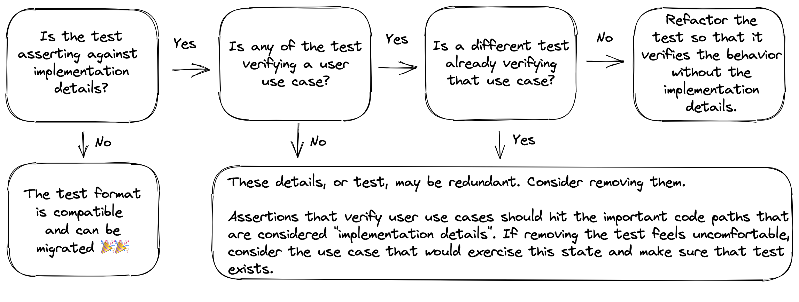

# OverReact Test to React Testing Library Migration Guide

- **[Introduction](#introduction)**
- **[Migration Background](#migration-background)**
- **[Migration Guides](#migration-guides)**
- **[Philosophy](#philosophy)**
  - **[Don't Test Implementation Details](#dont-test-implementation-details)**
  - **[Use Case Testing](#use-case-testing)**
    - **[What is a use case?](#what-is-a-use-case?)**
    - **[Verify You're Testing a Use Case](#verify-youre-testing-a-use-case)**
    - **[Identifying a Test's Use Case](#identifying-a-tests-use-case)**
- **[The Path Forward](#the-path-forward)**
- **[Deciding to Migrate a Test's Approach](#deciding-to-migrate-a-tests-approach)**
- **[Migrating to Use Case Testing](#migrating-to-use-case-testing)**
- **[Documentation References](#documentation-references)**

## Introduction

This document focuses on giving context around why migrating away from OverReact Test is necessary, how the broader migration guide is structured, and how the new testing philosophy affects Workiva's test patterns.

## Migration Background

The first big question - do we _have_ to migrate?

The only time you need to migrate is if the test is relying on a class component instance. This is because the new norm is to build components using the modern patterns of hooks, ref forwarding, and all the other tools that functional components expose. OverReact Test does not have full support for function based components, meaning that as we transition UI to utilize MUI components, the tests will need to be migrated as well.

However, all component tests can be migrated to gain the simplicity and maintainability offered by React Testing Library (RTL). RTL makes testing much more delightful, and by migrating our tests to it, we will be able to:

- Test components in a way that reflects how a user will actually interact with them.
- Avoid [the pitfalls of testing implementation details][implementation-details-blog].
- Encourage the accessibility of our components.

## Migration Guides

Migration guides are split into four parts that reflect how a test is set up:

```dart
import 'package:react/react.dart' as react;
import 'package:react_testing_library/matchers.dart' show isChecked;
import 'package:react_testing_library/react_testing_library.dart' as rtl;
import 'package:react_testing_library/user_event.dart';
import 'package:test/test.dart';

void main() {
  test('', () {
    // [1] Render the component.
    final result = rtl.render(react.input({'type': 'checkbox'}));

    // [2] Query for relevant nodes to test.
    final checkbox = result.getByRole('checkbox');

    // [3] Interact with the component.
    UserEvent.click(checkbox);

    // [4] Verify the expected result.
    expect(checkbox, isChecked);
  });
}
```

1. [Migration Guide for Component Rendering][rendering-migration-guide]
1. [Migration Guide for Queries][queries-migration-guide]
1. [Migration Guide for Component Interactions][component-interactions]
1. [Migration Guide for Expectations][expectations-migration-guide]

Each guide gives insight into the new mentality behind testing with RTL, along an overview of the APIs available to facilitate testing. Before diving into each of those though, make sure you understand RTL's philosophy and best practices (discussed below)!

## Philosophy

React Testing Library's (RTL) guiding philosophy is different from what many are used to coming from OverReact Test. Before migrating, take time to read this section and the connected blog posts. Then, as you are migrating tests, keep in mind that the migration may be adjusting the goal of a test as a whole in addition to the underlying APIs being used.

RTL's philosophy, in its simplest form, is:

> [The more your tests resemble the way your software is used, the more confidence they can give you.](https://testing-library.com/docs/guiding-principles)
>
> \- Kent C. Dodds

A key takeaway from that quote is [not to test implementation details][implementation-details-blog]. This is crucial because RTL is opinionated towards avoiding the implementation details, making the right thing the easy thing. On the flip side, if we need to refactor tests that historically deviated from this path, writing those tests becomes a lot more challenging. That means that migrating tests is also about making sure they are aligned with this philosophy and avoiding implementation details. Otherwise, the migration will be more difficult and not provide the confidence it should.

### Don't Test Implementation Details

When it's said not to test implementation details, what does that mean? Dodds [addresses][implementation-details-blog-implementation-explanation] that question. His short answer is:

> Implementation details are things which users of your code will not typically use, see, or even know about.

That means implementation details can be somewhat insidious. It's not just about avoiding using certain getters or patterns, but also about understanding what an API can reveal to a user and only testing those possibilities. Within the scope of migrating from OverReact Test, there are some code smells that are indicative of implementation details are being tested. Most of them stem from grabbing the component instance itself and utilizing the class APIs to check data on that instance (props, state, children, etc).

If you want to dive deeper into what implementation details are, Kent's [blog post][implementation-details-blog] is a great source.

### Use Case Testing

Use case testing is the answer to how to avoid testing implementation details. The goal of a test is to increase confidence that your software works like expected. As Dodds [notes][use-case-testing-react], it needs to work like expected for two groups:

- Other programmers who will use the code
- Users of the application

These two groups make up the actual users of the code. RTL is opinionated is towards verifying [use cases][use-case-testing] for those two groups, as opposed to traditional line or branch [code coverage][code-coverage]. In Kent's blog post he articulates more, but the tl;dr is that a line of code supports a use case for the API. Then, the lines should be tested by exercising their use cases.

#### What is a Use Case?

It will be important to know what a test's use case is before migrating it, so we want to establish what a use case actually is. Predictably, Dodds' [article][use-case-testing-react] helps with that. 😄

Summarizing from the article, a use case is a _scenario_ that causes a change that a user will notice. When we're defining a use case for an application user, it's likely interactions that change the UI. When the user is a developer, the scenario could be creating any side effect that the component is capable of (event emissions, HTTP calls, etc).

Note that a use case is defined by something _coming out_ of the component. Application users will be seeing the DOM that a component created. Developers will see data or events that leak outside the walls of the component. If a use case seems like it needs to look inside the component's instance to verify the outcome, that's an indication it's testing implementation details.

#### Verify You're Testing a Use Case

If it's ambiguous, checking that a test verifies a use case is important before the migration because otherwise migrating to RTL may feel like fitting a square peg into a round hole. When a test is relying on implementation details to verify an outcome, it is easier to first correlate those details with a use case. Once the use case is known, migrate the test with that use case in mind. That approach gives the insight to know what code needs to be converted, removed, or added to fit the new philosophy.

#### Identifying a Test's Use Case

Identifying a use case from an existing test is really just about figuring out what outcome the test is checking for the user. However, for some tests that may be non-trivial. Below are a couple steps to help guide the process:

1. Spend a little time understanding which parts of the implementation are important for this test and how those parts interact. Here are some guiding questions:

   - What are the implementation details being asserted against?
   - What effect do those details have on the user? What does the component do to show the user (application user or a developer) that this is happening?
   - How is the test currently interacting with the component to create that final result that is asserted against?
   - Are there any interactions that don't align with what is being asserted against? Does it seem like assertions could be missing?

1. Using the analysis of the implementation details, determine the scenario (i.e., "use case") being tested.

   There may be a temptation here to rely on the test description (the first parameter of the `test` function) to decide the use case being tested. That's another valuable data point, but over time, the test's focus may have shifted. Instead, we should keep it in mind but use the analysis of the test in the previous step to determine what the scenario is.

   With understanding of the important outcomes being tested, think through how the component would get into this circumstance out in the wild. What data needs to exist? What would the user have to do? The _scenario_ that matches what the test is trying to create is the use case!

## The Path Forward

Now that you understand RTL's philosophy, use case testing, and how to identify a use case, you can start your migration! As you work through tests, the related guides for rendering, querying, interacting, and expecting can be referenced.

The rest of this guide serves as a reference in the event that you encounter a test that is asserting against implementation details. If that happens, remember [how to identify a use case](#identifying-a-tests-use-case) and work through the decision tree below. Then, if it's necessary to migrate the test's approach, the [Migrating to Use Case Testing section](#migrating-to-use-case-testing) is dedicated to that effort.

## Deciding to Migrate a Test's Approach

In the case that you have encountered a test that is asserting against implementation details, use this section to decide what the best next step is. See "[Identifying a Tests Use Case](#identifying-a-tests-use-case)" if it is not clear what the test's use case is.

> NOTE: The first decision tree check ("Is the test asserting against implementation details?") is _very_ specific. If you are using implementation details to query or interact, the corresponding migration guides walk through adjusting that! This big "migrating approaches" deal is only if the _expectation_ part of the test is so reliant on implementation details that the test needs to be re-thought.



The outcomes are one of the following:

1. **A test is not verifying implementation details.** From there, the migration should be a relatively simple API swap.
1. **A test _is_ verifying implementation details but in an attempt to verify a use case.** From here, the test should be refactored to assert outcomes that a user would notice as opposed to the underlying implementation. This the focus of the [Migrating to Use Case Testing section](#migrating-to-use-case-testing).
1. **A test _is_ verifying implementation details for the sake of verifying a specific internal behavior.** In this case, it needs to be decided what value the test is actually adding. It's important to note that testing implementation details can be considered an anti-pattern, ultimately hurting the codebase. With that in mind, the best path forward is to determine if the test can be reworked to verify a use case. If that use case already has coverage, the test may be able to be removed. There are exceptions to every rule, but those should be rare.

## Migrating to Use Case Testing

This section focuses on giving a framework for rethinking tests that are asserting against implementation details.

This step is best after verifying in the decision tree that:

1. The test is asserting implementation details in an attempt to verify a use case
1. No other tests already verifies this use case

Remember that unnecessary tests, especially those which rely on implementation details, can cause developers grief! Once a test is deemed as necessary and needing to be refactored, we can take it through a few steps. Those steps are:

1. Determine if this test strategy is the most appropriate. For example:

   - If this is testing in isolation, would an integration environment be more appropriate for this test?
   - Or vise versa, if it's an integration test, would isolation be better?

   The testing strategy may still fit well, but the question can be asked in the context of knowing that the component will need to be tested as the user will exercise this use case. If the component is tightly coupled with another when used in the real world, the interaction may be much harder being tested in isolation versus with the other related components. It's less likely that the component is an integration test that should be tested in isolation instead, but given that the test's context has changed, it's worth double-checking that the integration strategy is still adding value.

1. Decide what the correct expectations are.

   This step doesn't need to have code. Instead, given what you now know about the test, imagine what the benchmarks for the user are when exercising this use case. What are the specific behaviors that the user should notice? This should not include any thought about what the implementation details are. Instead, what does the user see at the conclusion of the scenario and what are the important, noticeable steps prior to that outcome? Those are the expectations. If you need inspiration to know what the possibilities are, browse the matcher section in the [expectations guide][expectations-migration-guide] to see how RTL supports implementation detail free `expect` statements!

   In the case there feels like multiple use cases being tested, use the expectations as a guide to differentiate the use cases. If the use cases were grouped originally, they may be closely related. Answering why they're so closely related and what expectations they should share (and not share) can help inform how the test should be broken apart.

1. Remove anything that doesn't support the new expectations.

   The goal here is to remove as much cruft from the existing test as possible.

   The test may have assertions or lines that aren't necessary for the actual use case being tested. In the case that there does seem to be multiple use cases being tested, for each use case, create a new test and move over any important logic for those tests into the new test body. That can be revisited after migrating the current test.

   Depending on the test and your preference, it may even be worth removing _relevant_ interaction or expectation statements. Add code comments outlining the steps that existed before, with any important details, instead of leaving code that may just get in your way.

   In the end, the test should feel like a clean (not blank) slate that is ready to be reworked to the match the new, implementation detail free, expectations.

1. Begin the migration!

   From here, the test can be migrated like one that started without relying on implementation details. As noted, there is a guide for each major test section (rendering, querying, interacting, expecting). Since the original test is slimmed down, there may be gaps to fill in, but those guides will each gives examples of ways to use RTL to fill those in!

## Documentation References

This section includes links to the articles and APIs mentioned in this document.

### Blog Articles (all by Dodds)

- [Kent C. Dodds Testing Reference](https://kentcdodds.com/testing/)
- [Testing Implementation Details][implementation-details-blog]
- [How to Know What to Test](https://kentcdodds.com/blog/how-to-know-what-to-test)
- [Write Tests](https://kentcdodds.com/blog/write-tests)
- [Common RTL Mistakes](https://kentcdodds.com/blog/common-mistakes-with-react-testing-library)

### APIs

- [React Testing Library](https://testing-library.com/docs/react-testing-library/intro/) (JS)
- [React Testing Library](https://workiva.github.io/react_testing_library) (Dart)

[rendering-migration-guide]: https://github.com/Workiva/react_testing_library/blob/master/doc/migration_guides/component_rendering.md
[queries-migration-guide]: https://github.com/Workiva/react_testing_library/blob/master/doc/migration_guides/queries.md
[component-interactions]: https://github.com/Workiva/react_testing_library/blob/master/doc/migration_guides/component_interactions.md
[expectations-migration-guide]: https://github.com/Workiva/react_testing_library/blob/master/doc/migration_guides/expectations.md
[over-react-test]: https://github.com/Workiva/over_react_test
[implementation-details-blog]: https://kentcdodds.com/blog/testing-implementation-details
[implementation-details-blog-implementation-explanation]: https://kentcdodds.com/blog/testing-implementation-details#so-what-are-implementation-details-then
[use-case-testing]: https://kentcdodds.com/blog/how-to-know-what-to-test#code-coverage--use-case-coverage
[use-case-testing-react]: https://kentcdodds.com/blog/how-to-know-what-to-test#how-does-this-apply-to-react
[code-coverage]: https://kentcdodds.com/blog/write-tests#not-too-many
